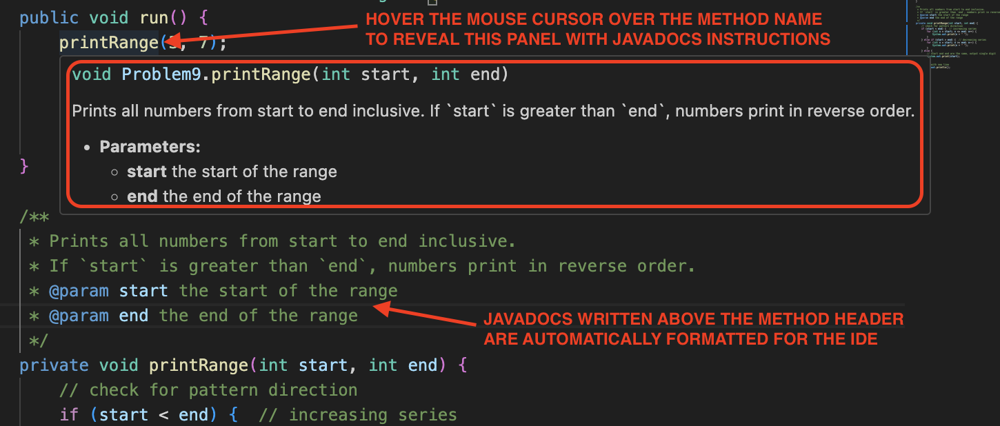

# Javadocs, Errors, and Exceptions  
This lesson introduces two important skills that help you write clearer and more reliable programs:

- documenting methods using Javadocs  
- understanding and handling errors (exceptions)

These topics work well together: Javadocs describe how a method *should* be used, and exceptions indicate when something *went wrong*.

## Compile‑Time Errors

A compile‑time error happens **before** your program runs. It occurs during **compilation**, which is the step where Java translates your code into machine instructions.

In VS Code, compilation happens automatically when you press Run. If the compiler finds problems, the program will not start.

Typical compile‑time errors include:

### Syntax errors
```java
System.out.println("Hello")   // missing semicolon
```

### Type mismatches
```java
int x = "hello";   // cannot assign a String to an int
```

### Invalid return type
```java
private int add(int a, int b) {
    return "hi";   // must return an int
}
```

### Missing return
```java
private int getValue() {
    // no return here
}
```

Compile‑time errors are usually fixed by correcting syntax, fixing types, or completing missing logic.

## Runtime Errors

A runtime error (exception) happens **while the program is running**. The code compiles successfully, but something unexpected occurs.

Runtime errors are more common when:

- the program interacts with user input
- string or array indexes are misused
- calculations involve restricted operations (division, square roots, etc.)

Common runtime exceptions include:

### ArithmeticException
```
int n = 10 / 0;
```

### IndexOutOfBoundsException
```
String s = "ABC";
char c = s.charAt(5);   // index 5 does not exist
```

### NumberFormatException
```
int x = Integer.parseInt("abc");   // cannot convert
```

### IllegalArgumentException
```
private int sqrt(int x) {
    if (x < 0) {
        throw new IllegalArgumentException("x must be non-negative");
    }
    return (int) Math.sqrt(x);
}
```

Why learn about exceptions?

- they help you **debug** more quickly  
- they tell you exactly **what went wrong**  
- understanding common exceptions helps you avoid them  

### Handling Runtime Errors with try/catch
You can also try to handle some of them in your program by using `try` and `catch`. 

A `try` block runs code that *might* cause an exception.  

A `catch` block runs only **if an exception actually occurs**, allowing your program to keep going instead of crashing.

We mostly use `try`/`catch` to prevent user input from crashing the program or to handle special cases where a method receives invalid values.

```java
public void run() {
    try {
        int n = readInt("Enter a number: ");
        System.out.println("You typed: " + n);
    } catch (Exception e) {
        System.out.println("Invalid input. Please enter a whole number.");
    }
}
```

### Important Notes About try/catch

- Code inside the `try` runs normally.  
- If an exception occurs, Java jumps to `catch` and runs that block.  
- After the `catch` finishes, the program continues normally after the whole try/catch.  
- `try`/`catch` does not repeat automatically. Thus, if you want to keep asking until the user enters something valid, you must put the try/catch inside a loop:

```java
while (true) {
    try {
        int n = readInt("Enter a number: ");
        return n;    // success!
    } catch (Exception e) {
        System.out.println("Invalid input. Try again.");
    }
}
```

In this example:

- the loop repeats  
- the `try` runs each time  
- if input is valid, return ends the method  
- if invalid, the `catch` runs and the loop continues  

<br>

# Javadocs and Method Documentation

When writing methods, it’s important that others — or future you! — can understand what they do. Javadocs are the official, structured format for documenting Java methods, classes, and libraries.

They serve two purposes:

1. They help humans understand your code.
2. Tools (like VS Code, IntelliJ, and Javadoc generators) can extract them to produce documentation pages.

Javadocs look something like this:

```java
/**
 * Prints a line containing the given number of stars.
 * @param length how many stars to print
 */
private void starLine(int length) {
    for (int i = 0; i < length; i++) {
        System.out.print("*");
    }
    System.out.println();
}
```

## What Are Javadocs?

Javadocs give programmers a consistent, structured way to document:

- what a method does  
- what each parameter means  
- what value is returned  
- what exceptions might occur  

Because the format is standardized, IDEs like VS Code can display pop‑up documentation when a method is hovered or called, like this:



In short, Javadocs are structured comments that describe how to use a method.

## What Javadocs Contain

A Javadoc block typically includes:

- A summary sentence  
- One `@param` tag per parameter  
- One `@return` tag for return methods  
- Optional `@throws` for exceptions  

### Examples of Javadocs
Here are some examples of methods and corresponding Javadocs:

#### No return value, one parameter
```java
/**
 * Prints a line containing the given number of stars.
 * @param length how many stars to print
 */
private void starLine(int length) {
    for (int i = 0; i < length; i++) {
        System.out.print("*");
    }
    System.out.println();
}
```

#### Multiple parameters
```java
/**
 * Returns the larger of two integers.
 * @param a the first number
 * @param b the second number
 * @return the larger of a and b
 */
private int max(int a, int b) {
    if (a > b) {
        return a;
    } else {
        return b;
    }
}
```

#### More complex logic
```java
/**
 * Counts how many vowels appear in the given uppercase string.
 * @param word the string to examine; should be uppercase
 * @return the number of vowels (A, E, I, O, U)
 */
private int countVowels(String word) {
    int count = 0;
    for (int i = 0; i < word.length(); i++) {
        char c = word.charAt(i);
        if ("AEIOU".indexOf(c) != -1) {
            count++;
        }
    }
    return count;
}
```

#### Validation + `IllegalArgumentException`
```java
/**
 * Returns the square root of x as an integer approximation.
 * @param x the number to square root; must be non-negative
 * @return an integer representing the approximate square root
 * @throws IllegalArgumentException if x is negative
 */
private int safeSqrt(int x) {
    if (x < 0) {
        throw new IllegalArgumentException("x must be non-negative");
    }
    return (int) Math.sqrt(x);
}
```

#### Making improvements
This example repeats the method name with no meaningful description. No mention of parameter or return values below:

```java
/**
 * Checks for even.
 */
private boolean isEven(int n) {
    return n % 2 == 0;
}
```

A much better version would look like this:
```java
/**
 * Determines whether the given integer is divisible by 2.
 * @param n the number to evaluate
 * @return true if n is an even number, false otherwise
 */
private boolean isEven(int n) {
    return n % 2 == 0;
}
```


## When Should You Use Javadocs?

### Simple methods

If a method is small, obvious, and has no parameters or return values, a short single-line comment is fine:

```java
// Draws a simple tree shape
public void drawTree() {
    rect(200, 400, 30, 90);
    ellipse(215, 360, 100, 100);
}
```

### Methods with parameters or return values

These should **always** have Javadocs so users understand how to call them correctly:

```java
/**
 * Returns true if the number is even.
 * @param n the integer to check
 * @return true if n is even; false otherwise
 */
private boolean isEven(int n) {
    return n % 2 == 0;
}
```

### Methods with non-obvious logic

Document methods that have:

- loops  
- conditions  
- validation  
- potential exceptions  

### In Summary

#### Use single-line comments for:
- simple drawing helpers
- trivial one-liners
- methods with no parameters or return values that are obvious from their name

#### Use full Javadocs for:
- any method with parameters  
- any method with a return value  
- any method involving clear logic or validation  
- any method meant for reuse  


<br>

# Practice Problems — Javadocs & Exceptions

Complete the following problems using the concepts from today’s lesson.

## Problem 1 — Add Javadocs to Simple Methods
Write proper Javadoc comments above each of the following simple methods.

```java
private int triple(int n) {
    return n * 3;
}

private boolean isUppercase(String s) {
    return s.equals(s.toUpperCase());
}
```

## Problem 2 — Javadocs with Multiple Parameters
Add full Javadocs describing the behaviour, parameters, and return value.

```java
private int max3(int a, int b, int c) {
    int max = a;
    if (b > max) max = b;
    if (c > max) max = c;
    return max;
}
```

## Problem 3 — Javadocs for Non-Obvious Logic
Write complete Javadocs explaining what *really* happens.

```java
private boolean hasVowel(String word) {
    for (int i = 0; i < word.length(); i++) {
        char c = Character.toUpperCase(word.charAt(i));
        if ("AEIOU".indexOf(c) != -1) {
            return true;
        }
    }
    return false;
}
```

## Problem 4 — Javadocs for a Method with Constraints
Add full Javadocs, including description, parameter details, return value, and the exception thrown.

```java
private int safePercent(int part, int whole) {
    if (whole == 0) {
        throw new IllegalArgumentException("whole must be non-zero");
    }
    return (part * 100) / whole;
}
```

## Problem 5 — Write Both the Javadocs and the Method
Write the missing method and its complete Javadocs.  
The method returns the first 3 characters of `s` repeated `times` times.  
Assume `s` has at least 3 characters.

```java
/**
 * TODO: Write full Javadocs here.
 */
private String frontTimes(String s, int times) {
    // TODO
}
```

## Problem 6 — Javadocs for a Method with Validation  
Write full Javadocs explaining what the method does, how it uses parameters, and under what conditions it throws an exception.

```java
private int difference(int a, int b) {
    if (a < b) {
        throw new IllegalArgumentException("a must be >= b");
    }
    return a - b;
}
```

## Problem 7 — Identify the Error Type
For each line, state whether the issue is a **compile‑time error** or a **runtime error**.

```
a) int x = "hello";
b) int x = 10 / 0;
c) private int f() { }
d) String s = "ABC"; char c = s.charAt(5);
e) int n = Integer.parseInt("xyz");
```


## Problem 8 — First try/catch  
Write a method that asks the user for an integer and returns it.  
If the user types something invalid (letters, symbols, blank input, etc.), the method should print an error message and return `–1` instead of crashing.

**HINT:**  
Use a `try/catch` around `readInt()` exactly like the example shown in the lesson.

```java
private int safeReadInt(String prompt) {
    // TODO
}
```

Example behaviour:

```
Enter a number: hello
Invalid input.
-1
```


## Problem 9 — Throwing Your Own Exception  
Write a method that computes the area of a circle using the formula  
`area = π * r * r`.

If `r` is negative, throw an `IllegalArgumentException` with a helpful message.

```java
private double areaOfCircle(double r) {
    // TODO
}
```


## Problem 10 — Safe String Index Lookup  
Write a method that safely returns the character at a given index.  
If the index is invalid (negative or past the end), return `'?'`.  
Do not use exceptions here. Instead, use normal `if` conditions.

```java
private char safeIndex(String word, int index) {
    // TODO
}
```